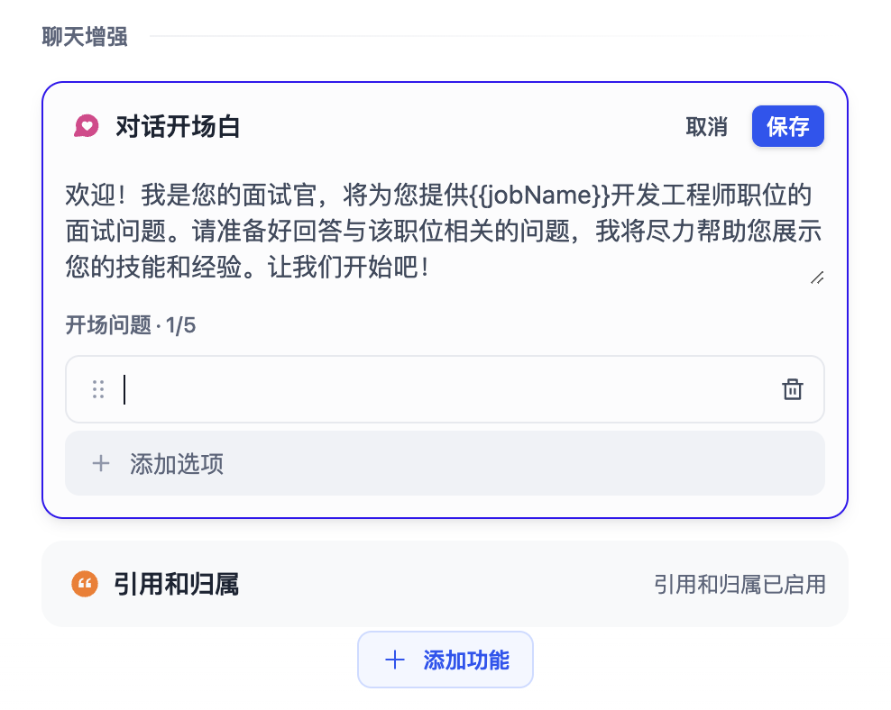
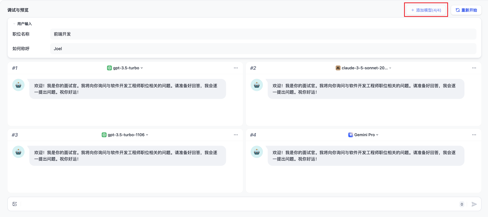

# 聊天助手

对话型应用采用一问一答模式与用户持续对话。

### 适用场景

对话型应用可以用在客户服务、在线教育、医疗保健、金融服务等领域。这些应用可以帮助组织提高工作效率、减少人工成本和提供更好的用户体验。

### 如何编排

对话型应用的编排支持：对话前提示词，变量，上下文，开场白和下一步问题建议。

下面边以做一个 **面试官** 的应用为例来介绍编排对话型应用。

#### 创建应用

在首页点击 “创建应用” 按钮创建应用。填上应用名称，应用类型选择**聊天助手**。

<figure><figcaption>
创建聊天助手
</figcaption></figure>

#### 编排应用

创建应用后会自动跳转到应用概览页。点击左侧菜单 **编排** 来编排应用。

<figure><figcaption>
应用编排
</figcaption></figure>

**填写提示词**

提示词用于约束 AI 给出专业的回复，让回应更加精确。你可以借助内置的提示生成器，编写合适的提示词。提示词内支持插入表单变量，例如 `{{input}}`。提示词中的变量的值会替换成用户填写的值。

示例：

1. 输入提示指令，要求给出一段面试场景的提示词。
2. 右侧内容框将自动生成提示词。
3. 你可以在提示词内插入自定义变量。

为了更好的用户体验，可以加上对话开场白：`你好，{{name}}。我是你的面试官，Bob。你准备好了吗？`。点击页面底部的 “添加功能” 按钮，打开 “对话开场白” 的功能：

<figure><figcaption></figcaption></figure>

编辑开场白时，还可以添加数个开场问题：

#### 添加上下文

如果想要让 AI 的对话范围局限在[知识库](../knowledge-base/)内，例如企业内的客服话术规范，可以在“上下文”内引用知识库。

.png>)

#### 调试

在右侧填写用户输入项，输入内容进行调试。

如果回答结果不理想，可以调整提示词和底层模型。你也可以使用多个模型同步进行调试，搭配出合适的配置。

**多个模型进行调试：**

如果使用单一模型调试时感到效率低下，你也可以使用**“多个模型进行调试”**功能，批量检视模型的回答效果。

最多支持同时添加 4 个大模型。

> ⚠️ 使用多模型调试功能时，如果仅看到部分大模型，这是因为暂未添加其它大模型的 Key。你可以在[“增加新供应商”](https://docs.mlchain.khulnasoft.com/v/zh-hans/guides/model-configuration/new-provider)内手动添加多个模型的 Key。

#### 发布应用

调试好应用后，点击右上角的 **“发布”** 按钮生成独立的 AI 应用。除了通过公开 URL 体验该应用，你也进行基于 APIs 的二次开发、嵌入至网站内等操作。详情请参考[发布](https://docs.mlchain.khulnasoft.com/v/zh-hans/guides/application-publishing)。

如果想定制已发布的应用，可以 Fork 我们的开源的 [WebApp 的模版](https://github.com/mlchain/webapp-conversation)。基于模版改成符合你的情景与风格需求的应用。
